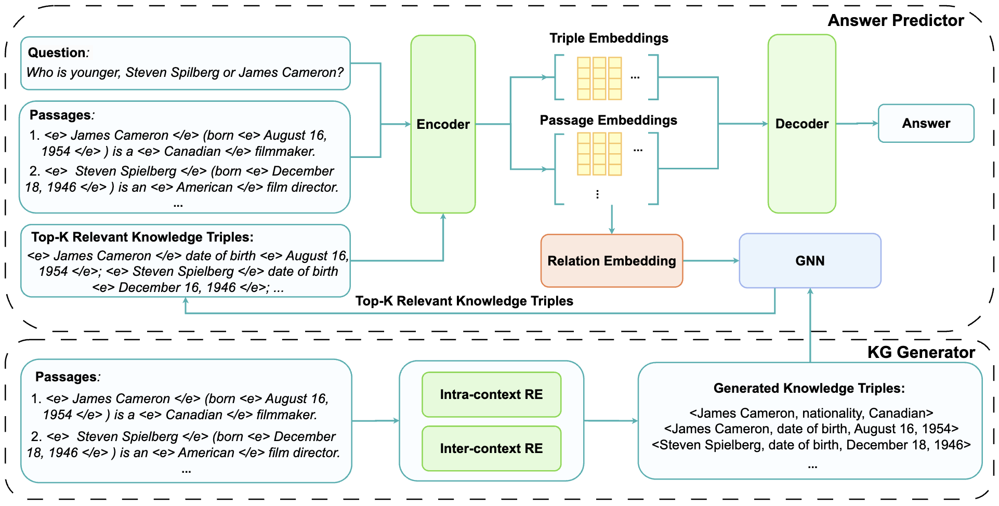

# REANO: Optimising Retrieval-Augmented Reader Models through Knowledge Graph Generation 

This repository contains the PyTorch implementation of our REANO framework. Details about REANO can be found in our [paper](https://aclanthology.org/2024.acl-long.115/).

## Introduction 
Open domain question answering (ODQA) aims to answer questions with knowledge from an external corpus. Fusion-in-Decoder (FiD) is an effective retrieval-augmented reader model to address this task. Given that FiD independently encodes passages, which overlooks the semantic relationships between passages, some studies use knowledge graphs (KGs) to establish dependencies among passages. However, they only leverage knowledge triples from existing KGs, which suffer from incompleteness and may lack certain information critical for answering given questions. To this end, in order to capture the dependencies between passages while tacking the issue of incompleteness in existing KGs, we propose to enhance the retrieval017 augmented reader model with a knowledge graph generation module (REANO). Specifically, REANO consists of a KG generator and an answer predictor. The KG generator aims to generate KGs from the passages and the answer predictor then generates answers based on the passages and the generated KGs.

<figure style="text-align: center;">
  
  <figcaption>Overview of REANO.</figcaption>
</figure>

## Preprocessing 

In the preprocessing step, we generate KG triples for the retrieved documents following these steps: 

### 1. Download Data 
For the NQ and TQA datasets, we use the data from the Fusion-in-Decoder repository [here](https://github.com/facebookresearch/FiD). For the other three datasets used in our experiments, we download them from their official websites: [EntityQuestions](https://github.com/princeton-nlp/EntityQuestions), [2WikiMultiHopQA](https://github.com/Alab-NII/2wikimultihop), [MuSiQue](https://github.com/StonyBrookNLP/musique). 

After downloading the data, we use Spacy NER tool and TAGME entity linking tool to identify the entities within the passages. Additionally, we also extract the KG triples between these entities from Wikidata. The processed data `*_with_triples.pkl` can be downloaded from the `qa_data` folder at [here](https://osf.io/58a3t/). 

### 2. Relation Extraction

In REANO, we train a DocuNet model on the REBEL dataset for intra-context relation extraction. To extract relations among entities within a passage, first download the relation information from the `rebel_data` folder at [here](https://osf.io/wn2q7/). Then download the DocuNet checkpoint from the `checkpoints` folder at the website. 

Run the following command to obtain intra-context relations:
```
python -m relation_extraction.docunet_inference \
    --relation2id /path/to/rebel_data/folder/relation2id.pkl \
    --docunet_checkpoint /path/to/DocuNet/checkpoint/folder/docunet.ckpt \
    --data_folder data/2wikimultihopqa
```
The `data_folder` is the folder where you put the `*_with_triples.pkl` files. Note that the DocuNet model requires specific versions of PyTorch and transformers to work, so you may need to follow the requirements in the `relation_extraction` folder to instantiate a new environment. The generated triples can be downloaded at [here](https://osf.io/58a3t/).

### 3. Prepare Data for Training and Evaluation 

After relation extraction, we can obtain files `*_with_pred_triples.pkl` that store the intra-context triples. Next, we need to merge these files with the Wikidata triples as follows:
```
python -m relation_extraction.merge_triples \
    --datafolder data/2wikimultihopqa/
```
The `data_folder` is the folder where you put the `*_with_triples.pkl` files as well as the `*_with_pred_triples.pkl` files. 

Note that the above preprocessing can take some time. You can directly download the preprocessed files `*_with_relevant_triples_wounkrel.pkl` from the `qa_data` folder at [here](https://osf.io/wn2q7/).

## Training and Evaluation 
Run the following script to train and evaluate REANO: 
```
bash task.sh 
``` 
This script will train and then evaluate the REANO model based on the provided data. 

You can download the trained checkpoints for different datasets from the `checkpoints` folder at [here](https://osf.io/wn2q7/). If you only wish to evaluate the model's performance, download the corresponding checkpoint and change the `--checkpoint` and `--name` parameters to specifiy the location of the checkpoint. Additionally, include the `--test_only` hyperparameter to perform evaluation without training.

## Citation 
If you find our paper and the resources useful, please kindly cite our paper:
```
@inproceedings{
    author={Jinyuan Fang and Zaiqiao Meng and Craig Macdonald},
    title={REANO: Optimising Retrieval-Augmented Reader Models through Knowledge Graph Generation}, 
    booktitle = {Proceedings of the 62nd Annual Meeting of the Association for Computational Linguistics},
    year={2024},
}
```
## Acknowledgements 
Our code is built upon the Fusion-in-Decoder and DocuNet repositories. We thank the authors of these projects for making their code publicly available!

## Contact 

If you have any questions about the code, feel free to contact me via fangjy6@gmail.com. 